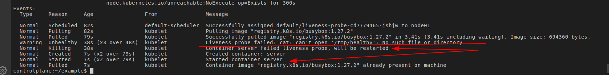
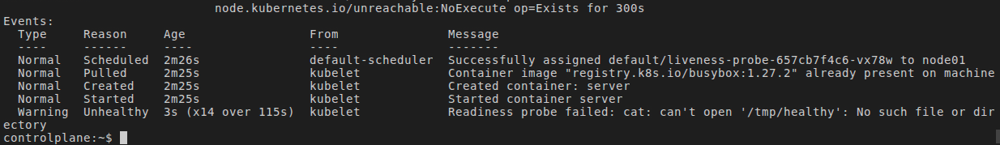

# **Nível 5 - Health Checks**

16. Crie um deployment com livenessProbe e readinessProbe
17. Faça o pod "falhar" propositalmente e observe o K8s reiniciá-lo
18. Configure startupProbe para apps que demoram a iniciar

## **1. livenessProbe**

* Mecanismo para detectar e remediar situações onde o app rodando em container apresenta uma falha que não é capaz de se recuperar (Erros ou Deadlock, por exemplo).
* Possibilita definir execução de comandos internamente em um Pod, ou de chamadas HTTP, para que seja verificado a saúde da aplicação.
* **Atributos importantes:**

  * `exec.command`: Passa os comandos a serem executados
  * `httpGet.path`, `httpGet.port`, ...: Definem a rota HTTP a ser enviado uma req. GET para verificação do status da aplicação
  * `periodSeconds`: Especifica período de tempo que o kubelet deve verificar a saúde da aplicação
  * `initialDelaySeconds`: Especifica tempo em que o kubelet deve esperar até fazer a primeira verificação
* **Restarta o Pod** em caso de falha

**Resultado:**

## **2. readinessProbe**

* Mecanismo útil para verificar se a aplicação está apta a receber tráfego. Caso falhe, kubernetes não envia tráfego ao Pod

  * App. inicia rápido mas precisa estabelecer conexão com DB, rodar migrations, etc...
* **NÃO RESTARTA O POD** em caso de falha

> **Resultado:**
> 

## **3. startupProbe**

* Mecanismo usado p/ proteger conteineres que demoram para iniciar
* Pode acontecer:

  1. Pod demora pra iniciar o app
  2. livenessProbe verifica que app. ainda não está rodando (e entende que o app. apresentou algum erro)
  3. livenessProbe restarta o pod
  4. Repete
* Enquanto o startupProbe está rodando, livenessProbe não é executado (espera o app. rodar)

  * Usa os atributos `periodSeconds` e `failureThreshold` (medidas em segundos)
  * O tempo de espera é `periodSeconds * failureThreshold`
  * Após esse tempo, livenessProbe pode ser executado

