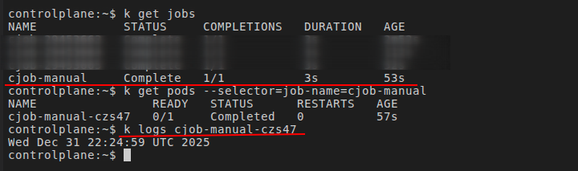
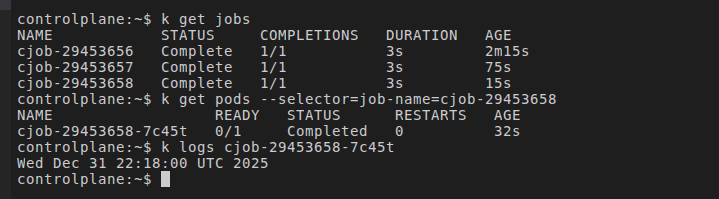

# **Nível 6 - Jobs e CronJobs**

19. Crie um Job que executa um script e termina
20. Crie um CronJob que roda a cada 2 minutos

---

### **1. Job: Executa uma tarefa pontual.**

* Cria um novo Pod, executa e termina o Pod
* Pode ser usado para rodar migrations em banco de dados, importa/exportar dados, processar arquivos, backup, etc...
* Se o Pod falhar, o Job pode recriar outro

---

### **2. CronJob: Executa uma tarefa pontual em determinados períodos.**

* Cria um novo Pod, executa e termina o Pod. Quando necessário nova execução, cria outro Pod
* Se o Pod falhar, o Job pode recriar outro
* Especificação do tempo de execução: [Verificar Documentação](https://kubernetes.io/docs/concepts/workloads/controllers/cron-jobs/)

---

### **Obs:**

Para verificar logs, verificar sempre do **Pod**, nunca do **Job/CronJob**.
