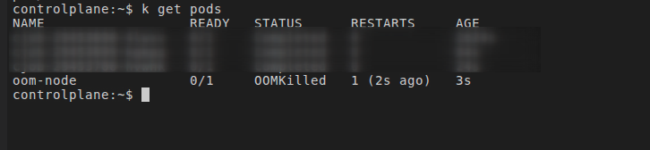

## **Objetivo**

1. Criar um Pod com limites de memória.
2. Rodar um processo que consome memória constantemente.
3. Fazer o container ultrapassar o limite definido.
4. Observar o Kubernetes matando o processo com o status **OOMKilled**.

---

## **O que o código faz**

Dentro do container Node.js, o script executa:
```js
const arr = [];
while(true) {
  arr.push(new Array(1024 * 1024 * 10).fill('x'));
}
```

* `new Array(1024 * 1024 * 10)` cria um array com **10 milhões de elementos**.
* `.fill('x')` preenche tudo com dados em memória.
* O loop `while(true)` adiciona novos arrays o tempo todo.

Resultado:
**A memória cresce até ultrapassar o limite do Pod.**

---

### **Por que ocorre OOMKilled?**

No manifesto:

* `requests.memory = 20Mi`
  → recurso mínimo esperado para agendamento.
* `limits.memory = 64Mi`
  → **máximo absoluto permitido pelo cgroup** do container.

Quando o processo dentro do container tenta usar mais de **64 MiB**, o kernel do Node do Kubernetes ativa o **OOM Killer**:

---
